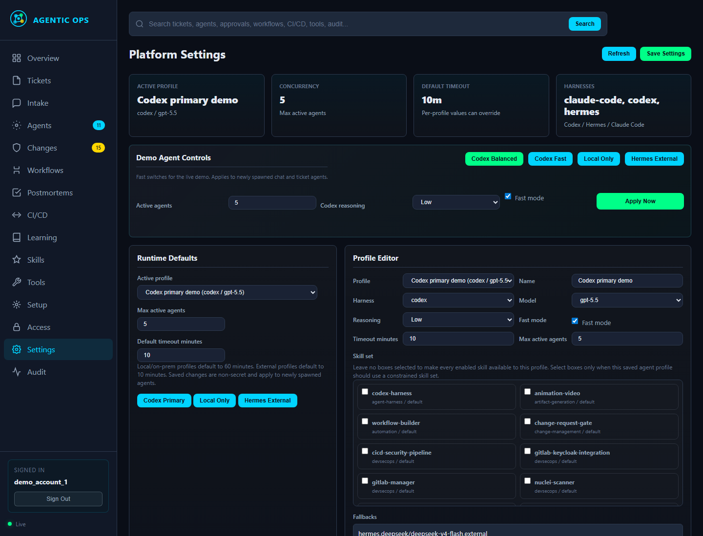
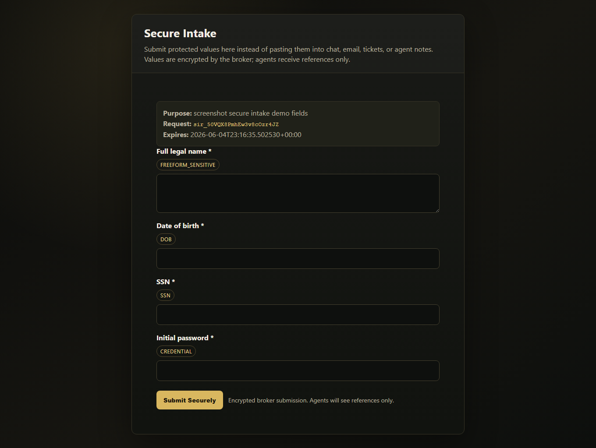
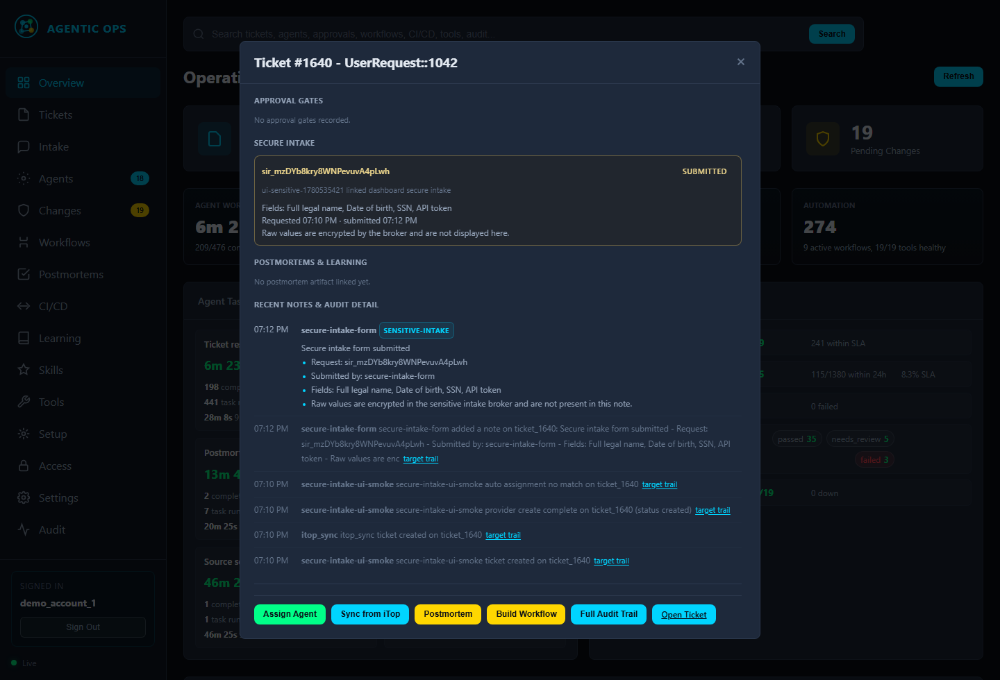

# Agentic IT

Agentic IT is a self-hosted control plane for turning enterprise operations into
governed agent-managed work.

It is designed for the work that normally falls between tools and teams:
tickets, alerts, access requests, service desk intake, CI/CD failures, email
reports, approvals, evidence collection, postmortems, and recurring operational
tasks. The platform gives agents enough context and capability to do real work,
while enforcing authentication, RBAC, scoped access, approval gates, audit, and
provider boundaries at the platform layer.

The goal is not another chatbot or a single-purpose automation. The goal is a
modular operations substrate that can sit above existing enterprise tools,
deploy reference modules where gaps exist, and gradually convert operational
labor into traceable agent workflows.

## What It Solves

Most enterprise automation rearranges work instead of removing it. A request may
start in chat, turn into a ticket, require identity context, need approval from
another team, involve a provider API, produce evidence, and still depend on a
human to keep the whole thread coherent.

Agentic IT provides one canonical work layer where:

- users can ask for help without knowing the right system, queue, or category;
- agents can investigate, ask follow-up questions, create or update tickets,
  use tools, and carry work forward;
- risky actions stop at real approval and access gates;
- provider systems stay synced without becoming the product boundary;
- completed work produces audit evidence, postmortems, reusable workflows,
  skills, tests, and knowledge.

## Core Capabilities

- **Universal intake:** accept work from chat, dashboard forms, ticket systems,
  alerts, email, CI/CD events, setup flows, and direct operator prompts.
- **Agent harness abstraction:** run Codex, Hermes, Claude Code, or future
  harnesses through one task/checkpoint contract.
- **Model gateway:** route agents through local, on-prem, private, or approved
  external model endpoints without hardcoding provider assumptions.
- **Provider adapters:** integrate ITSM, SIEM, IAM, email, CI/CD, search, and
  infrastructure tools as replaceable providers.
- **Governance:** enforce login, RBAC, approval gates, scoped credential leases,
  unsafe-action blockers, and audit trails outside the model.
- **Secure intake broker:** collect sensitive user-provided values through
  encrypted forms so agents receive references instead of raw secrets or PII.
- **Learning loop:** turn resolved work into postmortems, reusable workflows,
  knowledge articles, skills, and regression tests.
- **Reference modules:** deploy open-source examples for environments that need
  a working ITSM, SIEM, mail, identity, chat, CI/CD, or search module.

## Screenshots

### Runtime Profiles And Agent Controls



### Secure Intake Broker



### Ticket Evidence Without Raw Sensitive Values



## How It Works

```text
Work arrives
  chat, ticket, alert, email, CI/CD event, setup task, operator prompt
        |
        v
Control plane builds context
  requester, affected user, provider state, notes, approvals, tools,
  attachments, workflows, policies, skills, model route
        |
        v
Agent profile is selected
  Codex, Hermes, Claude Code, or another harness runs through the same
  task, checkpoint, notes, artifact, and audit contract
        |
        v
Agent works under platform guardrails
  investigates, asks questions, creates or updates tickets, calls tools,
  requests access or approval, records evidence
        |
        v
Outcome is preserved
  provider sync, ticket closure, user update, audit trail, postmortem,
  workflow or skill improvements
```

The agent is trusted to reason about operational work. The platform is
responsible for hard boundaries: authentication, authorization, provider
permissions, approval gates, credential brokering, sensitive data handling,
audit, retries, and recovery.

## Reference Architecture

Agentic IT is composed of a few durable contracts:

- **Dashboard and API:** the canonical work system for tickets, agents,
  approvals, notes, tools, setup, audit, workflows, postmortems, learning, and
  runtime settings.
- **PostgreSQL state:** canonical application state stored with explicit,
  parameterized SQL.
- **Agent runner:** queues work, resolves runtime profiles, launches harnesses,
  streams logs, records checkpoints, and supervises completion.
- **AI proxy:** provides a configurable model gateway for local, private,
  on-prem, or approved external routes.
- **Provider adapters:** translate between the canonical work model and systems
  such as ITSM, SIEM, IAM, mail, chat, CI/CD, search, and infrastructure tools.
- **Credential and sensitive-data brokers:** provide references and leases
  instead of leaking secrets, passwords, recovery codes, or protected personal
  data into tickets, chat, logs, memory, or model prompts.
- **Skills and workflows:** reusable operational capabilities that agents can
  apply, test, refine, and promote after successful work.

Current reference integrations include ITSM, SIEM/EDR, email/webmail, IAM,
CI/CD, chat intake, search, model proxying, and scanner modules. These are
examples, not fixed product boundaries.

## Example Workflows

### Chat To Ticket To Agent

A user asks for help in chat. The agent can answer directly, ask clarifying
questions, open a traceable ticket when work is needed, route it through the
appropriate provider, and continue updating the user from the same conversation.

### Account Access Or Recovery

The platform captures requester and affected-user context, routes the work,
blocks privileged changes behind approval and access gates, and records who
approved what.

### Phishing Report

A reported email becomes a ticket with evidence. Agents inspect safe metadata,
coordinate with mail and security providers, request approvals for risky
remediation, quarantine or contain when approved, update the user, and preserve
the audit trail.

### CI/CD Delivery Gate

Security and delivery scanners produce normalized findings. Agents can analyze
the failures, prepare remediation, attach evidence, and route changes through
approval before deployment.

### Setup And Onboarding

The installer plants the control plane and model gateway. Setup then becomes
auditable agent work: one scoped task per module or integration, with deploy,
integrate, disable, health-check, and teardown options.

## Quick Start

Clone the repository and create a runtime environment file:

```bash
git clone https://github.com/autonomouscereal/Agentic-IT.git
cd Agentic-IT
cp .env.example .env
```

Start the platform:

```bash
docker compose up -d --build
```

Or use the installer entrypoint:

```bash
./install.sh --proxy-mode deploy --harness auto --model-route local
```

Windows:

```powershell
.\install.ps1 --proxy-mode deploy --harness auto --model-route local
```

The installer starts the control plane, PostgreSQL, model gateway, runtime
configuration, and setup handoff. Environment-specific module deployment and
integration continue from the dashboard as auditable work.

## Configuration

Runtime behavior is intentionally configurable:

- choose Codex, Hermes, Claude Code, or future harnesses;
- set default and scoped model routes;
- switch between local-only and approved external model profiles;
- tune reasoning effort, fast mode, concurrency, and timeout per profile;
- assign saved agent profiles and skill sets by workflow, team, RACI group, or
  platform area;
- enable, integrate, deploy, health-check, or disable reference modules.

Secrets and credentials must come from runtime environment variables, vaults, or
brokered leases. Do not commit API keys, passwords, OAuth state, recovery codes,
private endpoints, or customer-specific inventory.

## Security Model

Agentic IT is built around governed autonomy:

- authentication is required before dashboard/API access;
- RBAC controls what users and agents can see or do;
- risky changes require approval gates;
- access to external systems is granted through scoped, auditable leases;
- sensitive intake values are encrypted and represented by references;
- provider adapters enforce permissions instead of relying on model judgment;
- suspicious URLs and untrusted files are handled through safe workflows;
- audit events and ticket evidence preserve what happened without exposing raw
  secrets.

The intended deployment posture is local or private first. External model or
provider routes should be explicit configuration choices, not defaults hidden in
code.

## Documentation

Core product docs:

- [Architecture](docs/ARCHITECTURE.md)
- [Enterprise Operations Vision](docs/ENTERPRISE_OPERATIONS_VISION.md)
- [Full Platform Blueprint](docs/FULL_PLATFORM.md)
- [API Reference](docs/API.md)
- [Deployment Runbook](docs/DEPLOYMENT.md)
- [One-Line Installer](docs/ONE_LINE_INSTALLER.md)
- [Agent Operations](docs/AGENT_OPERATIONS.md)
- [Agent Decision Model](docs/AGENT_DECISION_MODEL.md)

Capabilities and integrations:

- [Provider Adapters](docs/PROVIDER_ADAPTERS.md)
- [Service Desk Intake](docs/SERVICE_DESK_INTAKE.md)
- [Ops Chat Deployment Blueprint](docs/OPS_CHAT_DEPLOYMENT_BLUEPRINT.md)
- [Global Search And Ops Chat](docs/GLOBAL_SEARCH_AND_OPS_CHAT.md)
- [CI/CD Security Pipeline](docs/CICD_SECURITY_PIPELINE.md)
- [Sensitive Intake Broker](docs/SENSITIVE_INTAKE_BROKER.md)
- [Security And Approvals](docs/SECURITY_APPROVALS.md)
- [Agent Runtime Settings](docs/AGENT_RUNTIME_SETTINGS.md)

Validation and operations:

- [Testing Runbook](docs/TESTING.md)
- [Workflow Tests](docs/WORKFLOW_TESTS.md)
- [Known Issues](docs/KNOWN_ISSUES.md)
- [Demo Runbook](docs/DEMO_RUNBOOK.md)
- [Demo Ticket Catalog](docs/DEMO_TICKET_CATALOG.md)

## Development

Before submitting meaningful changes:

```bash
python -m pytest -q
python scripts/text_hygiene.py
docker compose config --quiet
```

For frontend changes, also run JavaScript syntax checks and visually verify the
affected workflow in a browser. For deployment, harness, provider, or broker
changes, run the matching smoke script from `scripts/`.

## Project Status

Agentic IT is an active product-build repository. The core contracts are in
place: dashboard state, provider adapters, agent harnesses, model gateway,
approval gates, secure intake, audit, setup workflows, and reference modules.
The next layer is broader provider coverage, stronger deployment packaging,
deeper workflow learning, and continued hardening for regulated environments.
