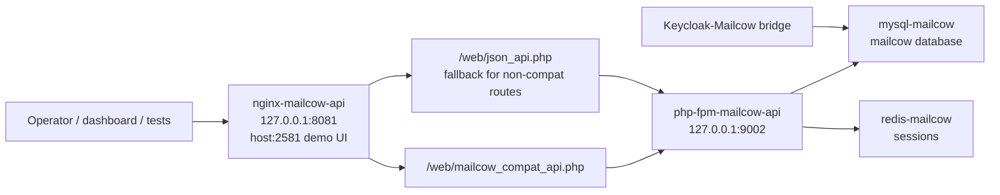

# Mailcow API Shim Blueprint

Last updated: 2026-05-18.

This document is the operator blueprint for the optional Mailcow HTTP API shim in the agentic IT/SOC platform. It explains why the shim exists, how it is deployed, how it is tested, how it fits the provider-agnostic platform, and how to repair it without leaking secrets.

## Purpose

The reference Mailcow deployment is a custom open-source email stack used when an environment needs a deployable email/mail-security capability. The canonical Mailcow bridge uses direct MySQL through the Mailcow container because the lab stack does not expose the complete upstream Mailcow web/API surface.

The API shim exists for compatibility:

- Give dashboard checks, future provider adapters, and demo tooling a stable HTTP API shape.
- Keep the Mailcow deployment usable in environments where agents/tools expect `GET /api/v1/get/...` style calls.
- Avoid making direct MySQL the only read path for inventory-style operations.
- Preserve direct MySQL as the supported write/provisioning fallback until the real upstream Mailcow API is fully available in a target environment.

The shim is intentionally narrow. It provides read-only compatibility for domains, mailboxes, aliases, and the Mailcow admin table endpoints needed for the lab demo. Mailbox creation, alias creation, user provisioning, distribution group setup, and Keycloak sync still use the direct MySQL bridge scripts unless a future environment provides a real Mailcow API with write support.

## Provider-Agnostic Position

Mailcow is not the platform contract. The platform contract is email capability:

- mailbox inventory
- domain inventory
- alias/distribution group inventory
- phishing-report intake
- mail-delivery context
- optional user/mailbox provisioning

Mailcow is the reference implementation. Exchange, Gmail, Proofpoint, Mimecast, Abnormal, or another gateway should satisfy the same email-provider contract through an adapter. The Mailcow shim is a reference adapter surface for the current lab, not a hard dependency for all deployments.

## Architecture



Live reference paths:

- Mailcow deployment root: `/home/cereal/Mailcow/deploy`
- Shim config root: `/home/cereal/Mailcow/deploy/api-nginx`
- Restricted API key file: `/home/cereal/Mailcow/deploy/api-nginx/.api_key`
- Compatibility PHP installed into web root: `/home/cereal/mailcow-dockerized/data/web/mailcow_compat_api.php`
- Deployer script: `/home/cereal/Mailcow/deploy/scripts/deploy_mailcow_api.py`
- Regression test: `/home/cereal/Mailcow/deploy/scripts/test_mailcow_api_shim.py`

Bundled reference skill paths:

- `reference_skills/keycloak-mailcow-bridge/scripts/deploy_mailcow_api.py`
- `reference_skills/keycloak-mailcow-bridge/scripts/mailcow_api_compat.php`
- `reference_skills/keycloak-mailcow-bridge/scripts/test_mailcow_api_shim.py`

## Endpoint Contract

Base URL in the reference lab:

```text
http://127.0.0.1:8081
```

Demo UI URL in the reference lab:

```text
http://192.168.50.222:2581
```

The UI port is for lab/demo access to the Mailcow admin surface. Keep the API
shim on `8081` for compatibility reads and use `2581` when showing Mailcow in a
browser. The bare `/` path on `2581` is intentionally routed to the admin login
surface because the custom deployment's root user-login path can return a blank
post-login body. The demo entrypoints also strip or clear stale `MCSESSID`
cookies so an old user session cannot redirect the browser back to `/user`;
demo operators should not need to know or type `/admin/`.

Required request header:

```text
X-API-Key: <from restricted key file or vault>
```

Supported read endpoints:

| Endpoint | Behavior |
| --- | --- |
| `GET /api/v1/get/domain/all` | Returns all domains as a JSON array |
| `GET /api/v1/get/domain/{domain}` | Returns matching domain rows |
| `GET /api/v1/get/mailbox/all` | Returns all mailboxes as a JSON array |
| `GET /api/v1/get/mailbox/{address}` | Returns matching mailbox rows |
| `GET /api/v1/get/alias/all` | Returns all aliases as a JSON array |
| `GET /api/v1/get/alias/{address}` | Returns matching alias rows |
| `POST /api/v1/search/domain` | Returns Mailcow/DataTables-shaped domain rows for the admin mailbox page |
| `GET /api/v1/get/quarantine/all` | Returns a JSON array of quarantine rows, empty when none exist |
| `GET /api/v1/get/domain/template/all` | Returns domain template rows, empty when none exist |
| `GET /api/v1/get/mailbox/template/all` | Returns mailbox template rows, empty when none exist |

Auth and method behavior:

| Condition | Expected result |
| --- | --- |
| Missing API key | HTTP `401` |
| Invalid API key | HTTP `401` |
| Valid API key | HTTP `200` for supported reads |
| POST to compatibility read endpoint | HTTP `405` |
| Unsupported resource | HTTP `404` |

Mailbox responses intentionally omit password hashes and other password-shaped fields.

## Deployment

Deploy or repair the shim on a host that already has the Mailcow stack running:

```bash
cd /home/cereal/Mailcow/deploy
python3 scripts/deploy_mailcow_api.py
```

The deployer is idempotent:

- verifies the Mailcow web root exists
- verifies the Mailcow `.env` file exists
- verifies the `mailcow/phpfpm:1.92` image exists
- verifies MySQL reachability from inside `mysql-mailcow`
- creates or repairs the Mailcow `api` table columns
- creates the `identity_provider` compatibility table when missing
- creates the `logs` compatibility table when missing
- repairs the custom `tfa` table shape expected by the mounted Mailcow UI
- repairs `fido2`, `settingsmap`, and `templates` schema drift used by the
  admin/configuration pages
- adds `mailbox.authsource` with default `mailcow` when missing
- patches ambiguous custom-schema UI queries from `kind` to `mailbox.kind`
- patches generated CSS/JS paths to `/web/cache` so the nginx sidecar can serve
  `/cache/<hash>.css` and `/cache/<hash>.js`
- appends `?v=<filemtime>` to generated CSS/JS URLs and sends no-store cache
  headers for `/cache/*` so browsers do not reuse stale broken demo assets
- installs `mailcow_compat_api.php` into the Mailcow web root
- writes the API key only to the restricted `api-nginx/.api_key` file
- recreates only the sidecar containers `php-fpm-mailcow-api` and `nginx-mailcow-api`
- exposes the read API on `8081` and the demo UI on `2581`
- routes exact `/` on the demo UI port to `/admin/` through FastCGI so the
  browser-visible demo entrypoint cannot land on the incomplete user-login path
- strips incoming cookies on `/` and `/admin/`, and clears both `PHPSESSID` and
  `MCSESSID` on `/user` and `/user/`, so stale user sessions recover to the
  admin login instead of a blank page
- provides compatibility JSON for UI table routes that are empty in the custom
  stock API path: domain search, quarantine listing, and empty template lists
- sets small lab quarantine defaults in Redis so the demo UI does not show a
  quarantine-disabled warning banner
- routes `/SOGo/*` back to `/admin/dashboard` because SOGo is not exposed
  through this custom demo shim
- runs built-in endpoint tests and demo UI cache-asset checks before reporting
  success

The deployer does not require host-side `MYSQL_ROOT_PASSWORD`. SQL setup is executed inside the `mysql-mailcow` container using the container-held environment. This prevents copying database passwords into command strings, docs, or dashboard config.

## Regression Testing

Run the full shim regression:

```bash
cd /home/cereal/Mailcow/deploy
python3 scripts/test_mailcow_api_shim.py --mysql-parity
```

The regression checks:

- missing API key returns `401`
- invalid API key returns `401`
- domain, mailbox, and alias `all` endpoints return JSON arrays
- mailbox responses omit password/hash fields
- selector reads work for one domain, one mailbox, and one alias
- POST to compatibility read endpoint returns `405`
- API domain/mailbox/alias counts match direct MySQL counts

Current verified result on 2026-05-18:

```text
13 passed, 0 failed
```

Run the platform doctor after any shim repair:

```bash
cd /home/cereal/SOC_TESTING/soc-dashboard
python3 scripts/platform_doctor.py
```

Current verified result on 2026-05-12:

```text
18 passed, 0 failed, 0 warned
```

Run the Keycloak-Mailcow bridge E2E suite to confirm the direct MySQL bridge still works after API-side changes:

```bash
cd /home/cereal/keycloak-mailcow-bridge
python3 scripts/test_integration.py
```

Current verified result on 2026-05-12:

```text
47 passed, 0 failed, 1 skipped
```

The single skip is expected in the current Keycloak 26.x lab because the custom user profile attribute is not declared; the sync state is used instead.

## Browser UI Regression

The reference deployer includes lightweight checks for the demo shim's browser
surface. After any UI/API shim repair, also run the headless browser crawl from
the operator workstation when Playwright is available. The latest verified
2026-05-18 crawl covered:

- `/admin/dashboard`
- `/admin/system`
- `/admin/mailbox`
- `/admin/queue`
- `/quarantine`
- `/SOGo/so`

Expected result: no JavaScript dialogs, no console errors, no failed requests,
no SQL warning alerts, and no invalid JSON alerts. Static help copy on the
queue page may contain the phrase "error message"; that is not a UI failure.
`/SOGo/so` should redirect to `/admin/dashboard` in the current shim.

## Security Model

Secrets:

- Do not commit API keys, database passwords, Redis passwords, or Mailcow admin passwords.
- Do not print the API key in deployer output, test output, logs, docs, or ticket notes.
- The API key file is restricted with mode `600`.
- Future production deployments should place the key in the platform credential vault or site secret manager and mount/read it at runtime.

Network:

- The reference shim exposes the compatibility API on `8081` and the demo UI on `2581` in the lab.
- Expose it beyond localhost only behind an approved reverse proxy, network policy, and authentication plan.
- Treat the shim as operational infrastructure. It should not be public internet-facing.
- The `dockerapi-mailcow` helper is host-networked in this custom deployment. Keep it loopback-only with firewall policy; do not expose its raw port externally.
- Extensionless Mailcow UI routes such as `/admin/dashboard` must be rewritten through FastCGI. Do not use `try_files $uri.php` in a plain static location because that can serve PHP source.
- The exact root URL `/` on the demo UI port should also be FastCGI-routed to
  `/admin/`. Do not send operators into the root user-login path unless that
  path has been separately repaired and browser-tested.
- Stale Mailcow user sessions can redirect admin entrypoints to `/user`. The
  reference shim strips cookies on the demo admin login entrypoints and clears
  `MCSESSID` on `/user`.

Data minimization:

- The compatibility endpoint exposes only inventory fields needed for automation context.
- Password hashes are intentionally excluded from mailbox responses.
- Write operations are not exposed through this compatibility endpoint.

Change control:

- Redeploying the sidecars should be tracked as a change when performed outside the lab.
- The main mail path remains in the existing Mailcow containers; the shim redeploy recycles only the API sidecars.

## Troubleshooting

### Valid key returns empty body or `{}`.

Likely cause:

- The request hit upstream `json_api.php` instead of the compatibility endpoint, or nginx did not rewrite the read endpoint correctly.

Check:

```bash
sed -n '1,220p' /home/cereal/Mailcow/deploy/api-nginx/nginx/conf/nginx.conf
```

Required nginx behavior:

- `GET /api/v1/get/domain/*`, `mailbox/*`, and `alias/*` rewrite to `mailcow_compat_api.php`.
- FastCGI forwards `HTTP_X_API_KEY`.
- FastCGI sets `HTTP_SEC_FETCH_DEST=empty`.

Repair:

```bash
cd /home/cereal/Mailcow/deploy
python3 scripts/deploy_mailcow_api.py
python3 scripts/test_mailcow_api_shim.py --mysql-parity
```

### Missing or invalid keys do not return 401.

Likely cause:

- Nginx is not forwarding `X-API-Key` into FastCGI, or the compatibility PHP file is stale.

Repair:

```bash
cd /home/cereal/Mailcow/deploy
python3 scripts/deploy_mailcow_api.py
```

### API key file is missing.

Repair only the restricted key file:

```bash
bash scripts/repair_mailcow_api_keyfile.sh
```

Then run:

```bash
python3 scripts/test_mailcow_api_shim.py --mysql-parity
```

### HTTP 500 from the shim.

Check sidecar logs:

```bash
docker logs --tail 100 nginx-mailcow-api
docker logs --tail 100 php-fpm-mailcow-api
```

Common causes:

- Mailcow web root not mounted.
- Redis session config not receiving the runtime `REDISPASS`.
- Missing compatibility database table.
- MySQL container unhealthy.

Preferred repair:

```bash
cd /home/cereal/Mailcow/deploy
python3 scripts/deploy_mailcow_api.py
```

### UI login redirects to 404 or shows PHP source.

Likely cause:

- Nginx is serving extensionless routes such as `/admin/dashboard` as static
  files instead of sending them through FastCGI.

Required nginx behavior:

- `location /` uses a named rewrite target such as `@php_extension`.
- The named target rewrites `^(.+)$` to `$1.php last`.
- The rewritten `.php` request is handled by the FastCGI `location ~ \.php$`
  block.

Repair:

```bash
cd /home/cereal/Mailcow/deploy
python3 scripts/deploy_mailcow_api.py
```

### UI is unstyled or blank after login.

Likely cause:

- The generated Mailcow cache assets return `404`. In the split sidecar setup,
  php-fpm must write minified CSS/JS into the mounted web root at `/web/cache`;
  writing them to the php-fpm container's `/tmp` makes nginx unable to serve
  `/cache/<hash>.css` and `/cache/<hash>.js`.

Repair:

```bash
cd /home/cereal/Mailcow/deploy
python3 scripts/deploy_mailcow_api.py
```

The deployer creates `/web/cache`, permissions it for the php-fpm worker,
patches `header.inc.php` and `footer.inc.php` to use `/web/cache`, appends a
file-mtime version query to generated asset URLs, and verifies the generated
cache refs return HTTP `200`.

### Root URL or `/admin/` is blank after submit.

Likely cause:

- The browser is using `http://HOST:2581/`, which historically hit the custom
  deployment's incomplete root user-login flow. That flow can return an empty
  body after a successful-looking submit even though the admin UI is healthy.
- The browser may also hold a stale Mailcow `MCSESSID` from the user-login path.
  In that case `/admin/` redirects to `/user`, and `/user` returns the blank
  5-byte response.

Repair:

```bash
cd /home/cereal/Mailcow/deploy
python3 scripts/deploy_mailcow_api.py
```

The deployer routes exact `/` and `/admin/` through FastCGI to the admin login
surface by using `/web/admin/index.php` as the script and `/admin/` as the
request URI. It strips incoming cookies on those login entrypoints and clears
both `PHPSESSID` and `MCSESSID` on `/user` before redirecting back to `/`.
After repair, a browser login from the bare root URL should land on
`/admin/dashboard` with visible dashboard content.

### Admin pages show invalid JSON, SQL column, or missing-table warnings.

Likely cause:

- The custom Mailcow database seed has drifted from the mounted web code.
- Stock `json_api.php` returns empty bodies for UI table endpoints in this
  sidecar context.

Repair:

```bash
cd /home/cereal/Mailcow/deploy
python3 scripts/deploy_mailcow_api.py
```

The deployer repairs the known UI schema drift (`fido2`, `settingsmap`,
`templates`, `tfa`, `mailbox.authsource`), routes UI DataTables calls to the
compatibility API, validates those JSON endpoints, and clears the demo
quarantine warning by setting lab Redis defaults.

### Admin login loops or fails after the password is correct.

Likely causes:

- The custom seed is missing the Mailcow `logs` table.
- The `tfa` table still has the legacy `id,data` shape and lacks `key_id`.
- The custom mailbox/domain schema makes unqualified `kind` ambiguous.

Repair with the deployer. It creates `logs`, repairs `tfa`, adds
`mailbox.authsource`, and patches the mounted UI query to use `mailbox.kind`.

Latest live verification on 2026-05-18:

- `http://192.168.50.222:2581/` returns the Mailcow login page.
- Admin form login from the bare root URL for `demo_account_1` reaches
  `/admin/dashboard`.
- `/admin/dashboard` renders through FastCGI and does not expose PHP source.
- Generated `/cache` CSS/JS assets load with versioned URLs and no-store
  headers.
- Stale `MCSESSID` recovery is verified by the deployer.
- Headless browser verification reports zero failed network requests and zero
  console errors across `/admin/dashboard`, `/admin/system`, `/admin/mailbox`,
  `/admin/queue`, `/quarantine`, and `/SOGo/so`.
- UI table JSON is verified for domain search, quarantine, domain templates,
  and mailbox templates, with no DataTables invalid JSON dialogs.
- SQL compatibility schema is verified for `logs`, `tfa`, `fido2`,
  `settingsmap`, `templates`, and `mailbox.authsource`.
- IMAP auth for `demo_account_1@mailcow.local` returns `OK`.

### MySQL parity fails.

If API reads work but counts do not match MySQL:

- Confirm the compatibility PHP file is installed from the current skill.
- Confirm no stale PHP file exists in the web root.
- Confirm the test is pointed at the same Mailcow deployment as the database.
- Run the deployer again and retest.

## Rollback

The shim is isolated from the primary Mailcow mail path. To disable the optional API sidecars:

```bash
docker stop nginx-mailcow-api php-fpm-mailcow-api
docker rm nginx-mailcow-api php-fpm-mailcow-api
```

Do not remove the main Mailcow containers unless you are intentionally rolling back the full email stack. Direct MySQL bridge operations continue to work without the HTTP shim.

## Operational Checklist

Before a demo or deployment review:

- `docker ps` shows `nginx-mailcow-api` and `php-fpm-mailcow-api` running.
- `python3 scripts/test_mailcow_api_shim.py --mysql-parity` passes.
- `python3 scripts/platform_doctor.py` passes from the dashboard repo.
- `python3 scripts/test_integration.py` passes from the Keycloak-Mailcow bridge repo.
- No API keys or passwords appear in command output or docs.
- Mailbox output has no password/hash fields.
- Direct MySQL bridge remains documented as canonical for writes.

## Future Work

Recommended next iterations:

- Promote the email provider contract into a first-class dashboard adapter with Mailcow, Exchange, Gmail, Proofpoint, and generic webhook implementations.
- Add a dashboard health card for Mailcow shim status and direct bridge status separately.
- Add key rotation workflow for the Mailcow API key with a change request and regression test.
- Add optional reverse-proxy/TLS blueprint for environments that need non-localhost API access.
- Replace direct MySQL write operations with real provider APIs when the selected product supports them reliably.
