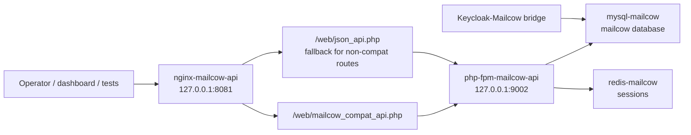

# Mailcow API Shim Blueprint

Last updated: 2026-05-12.

This document is the operator blueprint for the optional Mailcow HTTP API shim in the agentic IT/SOC platform. It explains why the shim exists, how it is deployed, how it is tested, how it fits the provider-agnostic platform, and how to repair it without leaking secrets.

## Purpose

The reference Mailcow deployment is a custom open-source email stack used when an environment needs a deployable email/mail-security capability. The canonical Mailcow bridge uses direct MySQL through the Mailcow container because the lab stack does not expose the complete upstream Mailcow web/API surface.

The API shim exists for compatibility:

- Give dashboard checks, future provider adapters, and demo tooling a stable HTTP API shape.
- Keep the Mailcow deployment usable in environments where agents/tools expect `GET /api/v1/get/...` style calls.
- Avoid making direct MySQL the only read path for inventory-style operations.
- Preserve direct MySQL as the supported write/provisioning fallback until the real upstream Mailcow API is fully available in a target environment.

The shim is intentionally narrow. It provides read-only compatibility for domains, mailboxes, and aliases. Mailbox creation, alias creation, user provisioning, distribution group setup, and Keycloak sync still use the direct MySQL bridge scripts unless a future environment provides a real Mailcow API with write support.

## Provider-Agnostic Position

Mailcow is not the platform contract. The platform contract is email capability:

- mailbox inventory
- domain inventory
- alias/distribution group inventory
- phishing-report intake
- mail-delivery context
- optional user/mailbox provisioning

Mailcow is the reference implementation. Exchange, Gmail, Proofpoint, Mimecast, Abnormal, or another gateway should satisfy the same email-provider contract through an adapter. The Mailcow shim is a reference adapter surface for the current lab, not a hard dependency for all deployments.

## Architecture



Live reference paths:

- Mailcow deployment root: `/home/cereal/Mailcow/deploy`
- Shim config root: `/home/cereal/Mailcow/deploy/api-nginx`
- Restricted API key file: `/home/cereal/Mailcow/deploy/api-nginx/.api_key`
- Compatibility PHP installed into web root: `/home/cereal/mailcow-dockerized/data/web/mailcow_compat_api.php`
- Deployer script: `/home/cereal/Mailcow/deploy/scripts/deploy_mailcow_api.py`
- Regression test: `/home/cereal/Mailcow/deploy/scripts/test_mailcow_api_shim.py`

Bundled reference skill paths:

- `reference_skills/keycloak-mailcow-bridge/scripts/deploy_mailcow_api.py`
- `reference_skills/keycloak-mailcow-bridge/scripts/mailcow_api_compat.php`
- `reference_skills/keycloak-mailcow-bridge/scripts/test_mailcow_api_shim.py`

## Endpoint Contract

Base URL in the reference lab:

```text
http://127.0.0.1:8081
```

Required request header:

```text
X-API-Key: <from restricted key file or vault>
```

Supported read endpoints:

| Endpoint | Behavior |
| --- | --- |
| `GET /api/v1/get/domain/all` | Returns all domains as a JSON array |
| `GET /api/v1/get/domain/{domain}` | Returns matching domain rows |
| `GET /api/v1/get/mailbox/all` | Returns all mailboxes as a JSON array |
| `GET /api/v1/get/mailbox/{address}` | Returns matching mailbox rows |
| `GET /api/v1/get/alias/all` | Returns all aliases as a JSON array |
| `GET /api/v1/get/alias/{address}` | Returns matching alias rows |

Auth and method behavior:

| Condition | Expected result |
| --- | --- |
| Missing API key | HTTP `401` |
| Invalid API key | HTTP `401` |
| Valid API key | HTTP `200` for supported reads |
| POST to compatibility read endpoint | HTTP `405` |
| Unsupported resource | HTTP `404` |

Mailbox responses intentionally omit password hashes and other password-shaped fields.

## Deployment

Deploy or repair the shim on a host that already has the Mailcow stack running:

```bash
cd /home/cereal/Mailcow/deploy
python3 scripts/deploy_mailcow_api.py
```

The deployer is idempotent:

- verifies the Mailcow web root exists
- verifies the Mailcow `.env` file exists
- verifies the `mailcow/phpfpm:1.92` image exists
- verifies MySQL reachability from inside `mysql-mailcow`
- creates or repairs the Mailcow `api` table columns
- creates the `identity_provider` compatibility table when missing
- installs `mailcow_compat_api.php` into the Mailcow web root
- writes the API key only to the restricted `api-nginx/.api_key` file
- recreates only the sidecar containers `php-fpm-mailcow-api` and `nginx-mailcow-api`
- runs built-in endpoint tests before reporting success

The deployer does not require host-side `MYSQL_ROOT_PASSWORD`. SQL setup is executed inside the `mysql-mailcow` container using the container-held environment. This prevents copying database passwords into command strings, docs, or dashboard config.

## Regression Testing

Run the full shim regression:

```bash
cd /home/cereal/Mailcow/deploy
python3 scripts/test_mailcow_api_shim.py --mysql-parity
```

The regression checks:

- missing API key returns `401`
- invalid API key returns `401`
- domain, mailbox, and alias `all` endpoints return JSON arrays
- mailbox responses omit password/hash fields
- selector reads work for one domain, one mailbox, and one alias
- POST to compatibility read endpoint returns `405`
- API domain/mailbox/alias counts match direct MySQL counts

Current verified result on 2026-05-12:

```text
13 passed, 0 failed
```

Run the platform doctor after any shim repair:

```bash
cd /home/cereal/SOC_TESTING/soc-dashboard
python3 scripts/platform_doctor.py
```

Current verified result on 2026-05-12:

```text
18 passed, 0 failed, 0 warned
```

Run the Keycloak-Mailcow bridge E2E suite to confirm the direct MySQL bridge still works after API-side changes:

```bash
cd /home/cereal/keycloak-mailcow-bridge
python3 scripts/test_integration.py
```

Current verified result on 2026-05-12:

```text
47 passed, 0 failed, 1 skipped
```

The single skip is expected in the current Keycloak 26.x lab because the custom user profile attribute is not declared; the sync state is used instead.

## Security Model

Secrets:

- Do not commit API keys, database passwords, Redis passwords, or Mailcow admin passwords.
- Do not print the API key in deployer output, test output, logs, docs, or ticket notes.
- The API key file is restricted with mode `600`.
- Future production deployments should place the key in the platform credential vault or site secret manager and mount/read it at runtime.

Network:

- The reference shim listens on `127.0.0.1:8081` on the Mailcow host.
- Expose it beyond localhost only behind an approved reverse proxy, network policy, and authentication plan.
- Treat the shim as operational infrastructure. It should not be public internet-facing.

Data minimization:

- The compatibility endpoint exposes only inventory fields needed for automation context.
- Password hashes are intentionally excluded from mailbox responses.
- Write operations are not exposed through this compatibility endpoint.

Change control:

- Redeploying the sidecars should be tracked as a change when performed outside the lab.
- The main mail path remains in the existing Mailcow containers; the shim redeploy recycles only the API sidecars.

## Troubleshooting

### Valid key returns empty body or `{}`.

Likely cause:

- The request hit upstream `json_api.php` instead of the compatibility endpoint, or nginx did not rewrite the read endpoint correctly.

Check:

```bash
sed -n '1,220p' /home/cereal/Mailcow/deploy/api-nginx/nginx/conf/nginx.conf
```

Required nginx behavior:

- `GET /api/v1/get/domain/*`, `mailbox/*`, and `alias/*` rewrite to `mailcow_compat_api.php`.
- FastCGI forwards `HTTP_X_API_KEY`.
- FastCGI sets `HTTP_SEC_FETCH_DEST=empty`.

Repair:

```bash
cd /home/cereal/Mailcow/deploy
python3 scripts/deploy_mailcow_api.py
python3 scripts/test_mailcow_api_shim.py --mysql-parity
```

### Missing or invalid keys do not return 401.

Likely cause:

- Nginx is not forwarding `X-API-Key` into FastCGI, or the compatibility PHP file is stale.

Repair:

```bash
cd /home/cereal/Mailcow/deploy
python3 scripts/deploy_mailcow_api.py
```

### API key file is missing.

Repair only the restricted key file:

```bash
bash scripts/repair_mailcow_api_keyfile.sh
```

Then run:

```bash
python3 scripts/test_mailcow_api_shim.py --mysql-parity
```

### HTTP 500 from the shim.

Check sidecar logs:

```bash
docker logs --tail 100 nginx-mailcow-api
docker logs --tail 100 php-fpm-mailcow-api
```

Common causes:

- Mailcow web root not mounted.
- Redis session config not receiving the runtime `REDISPASS`.
- Missing compatibility database table.
- MySQL container unhealthy.

Preferred repair:

```bash
cd /home/cereal/Mailcow/deploy
python3 scripts/deploy_mailcow_api.py
```

### MySQL parity fails.

If API reads work but counts do not match MySQL:

- Confirm the compatibility PHP file is installed from the current skill.
- Confirm no stale PHP file exists in the web root.
- Confirm the test is pointed at the same Mailcow deployment as the database.
- Run the deployer again and retest.

## Rollback

The shim is isolated from the primary Mailcow mail path. To disable the optional API sidecars:

```bash
docker stop nginx-mailcow-api php-fpm-mailcow-api
docker rm nginx-mailcow-api php-fpm-mailcow-api
```

Do not remove the main Mailcow containers unless you are intentionally rolling back the full email stack. Direct MySQL bridge operations continue to work without the HTTP shim.

## Operational Checklist

Before a demo or deployment review:

- `docker ps` shows `nginx-mailcow-api` and `php-fpm-mailcow-api` running.
- `python3 scripts/test_mailcow_api_shim.py --mysql-parity` passes.
- `python3 scripts/platform_doctor.py` passes from the dashboard repo.
- `python3 scripts/test_integration.py` passes from the Keycloak-Mailcow bridge repo.
- No API keys or passwords appear in command output or docs.
- Mailbox output has no password/hash fields.
- Direct MySQL bridge remains documented as canonical for writes.

## Future Work

Recommended next iterations:

- Promote the email provider contract into a first-class dashboard adapter with Mailcow, Exchange, Gmail, Proofpoint, and generic webhook implementations.
- Add a dashboard health card for Mailcow shim status and direct bridge status separately.
- Add key rotation workflow for the Mailcow API key with a change request and regression test.
- Add optional reverse-proxy/TLS blueprint for environments that need non-localhost API access.
- Replace direct MySQL write operations with real provider APIs when the selected product supports them reliably.
